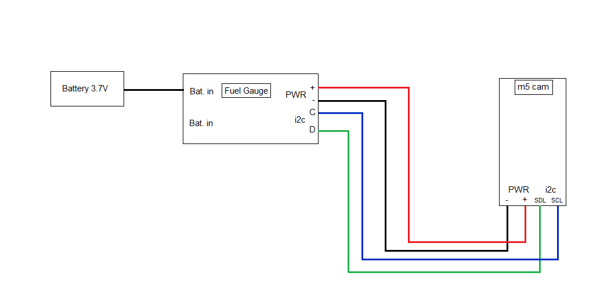
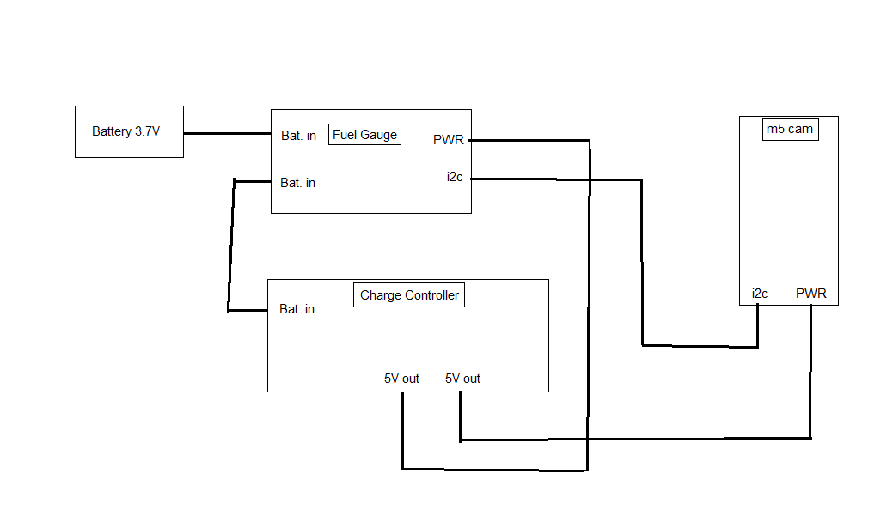

# M5STACK Timer Camera (esp32) example using DFRobot's Fuel Gauge

Example project to use DFRobot's Fuel Gauge for checking Li-Po batteries level.

Project developed in ESP-IDF environment on Windows 10.

## Step by step guide:
### How to connect the camera to the Fuel Gauge
The connectors of both units are different. The Fuel Gauge connector doesn't correspond with the *Grove* connector of the camera, so the cables have to be switched in positions to match each connector. If we look at both devices with the connector side facing us the pinout is as follows:
- Fuel Gauge: SDC, SDL, GND, VCC
- Camera: GND, VCC, SDL, SDC
In the image below, we can see how to connect them:

And if we use the *Solar Power Manager 5V* from DFRobot:

### Installing IDF and flashing the code to the camera
- Download and install the toolchain following the instructions: 
https://docs.espressif.com/projects/esp-idf/en/latest/esp32/get-started/windows-setup.html
- After that, open a ESP-IDF CMD terminal and navigate to the project folder
- Clone this repo on the project folder
- On the IDF terminal run `idf.py set-target esp32`
    - If you get an error saying: 
    ``` CMake Error at components/arduino/CMakeLists.txt:215 (message):
        esp32-arduino requires CONFIG_FREERTOS_HZ=1000 (currently 100)```
    Then edit the file *sdkconfig* and assign *CONFIG_FREERTOS_HZ=1000*
    - To test that this works, run `idf.py menuconfig` and check that you have the option *Arduino Condiguration* in the menu
    - Press exit to close menuconfig
    
- Run `idf.py -p <PORT> -b 112500 flash monitor` to build, flash the code to the board (Takes a couple of minutes) and open the serial monitor in one command
    - If you don't know the port, go to Windows' *Device Manager* and check under *Ports (COM & LPT)*
